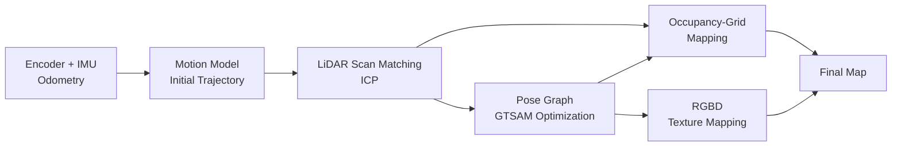
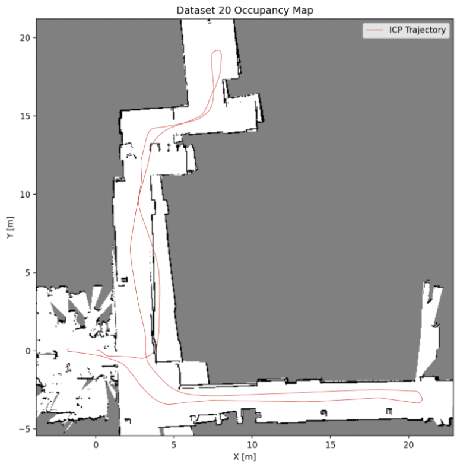
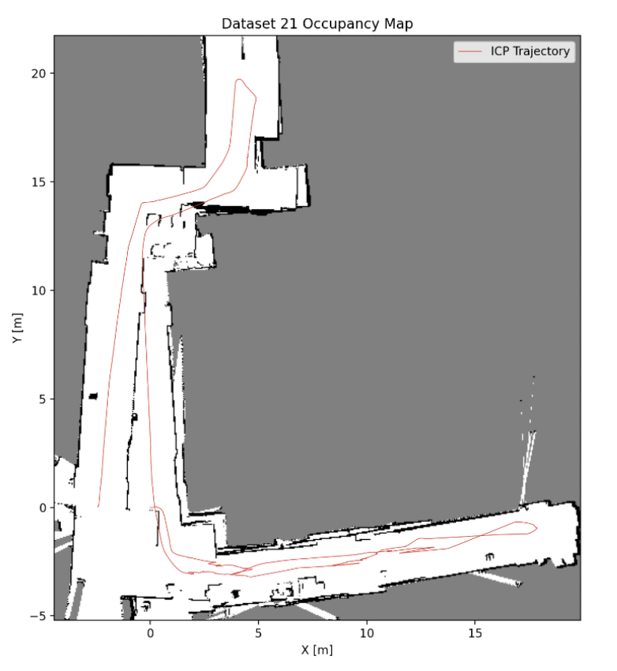

<div align="center">

# LIDAR-SLAM

**A full SLAM pipeline for a differential-drive robot — wheel/IMU odometry, LiDAR scan matching with ICP, occupancy-grid mapping, RGBD texture mapping, and pose-graph optimization in GTSAM.**


</div>

---

## Overview

This project implements an end-to-end Simultaneous Localization and Mapping (SLAM) system for a differential-drive robot. It fuses proprioceptive and exteroceptive sensing to estimate the robot's trajectory and reconstruct a consistent map of its environment:

- **Motion model** from wheel-encoder and IMU odometry to seed the trajectory.
- **LiDAR scan matching** via Iterative Closest Point (ICP) to refine relative pose between scans.
- **Occupancy-grid mapping** to build a probabilistic 2D map from aligned LiDAR scans.
- **Pose-graph optimization** in [GTSAM](https://gtsam.org/) to enforce global consistency and close loops.
- **RGBD texture mapping** to project camera color onto the estimated floor/ground map.

The full write-up, including derivations and results, is available in [`Report.pdf`](./Report.pdf).

## Pipeline



## Repository structure

| File | Role |
| --- | --- |
| `main.py` | Entry point — runs the full SLAM pipeline end to end. |
| `icp.py` | Iterative Closest Point implementation for point-cloud registration. |
| `scan_matching.py` | LiDAR scan-to-scan / scan-to-map matching built on ICP. |
| `occupancy_mapping.py` | Builds the probabilistic occupancy grid from aligned scans. |
| `pose_map.py` | Pose-graph construction and optimization (GTSAM backend). |
| `color_map.py` | RGBD texture mapping — projects camera color onto the map. |
| `test_icp.py` | Unit tests for the ICP implementation. |
| `Report.pdf` | Technical report with methods, math, and results. |

## Getting started

### Prerequisites

The project is pure Python. Inferred dependencies (adjust to match your environment):

```bash
pip install numpy scipy matplotlib opencv-python gtsam
```

> The data files (encoder/IMU/LiDAR/RGBD) are not included in the repo. Point the loader paths in `main.py` to your dataset before running.

### Clone

```bash
git clone https://github.com/shambhavi12001/LIDAR-SLAM.git
cd LIDAR-SLAM
```

### Run

```bash
python main.py
```

### Test

```bash
python test_icp.py
```

## Method notes

**ICP scan matching.** Relative pose between consecutive LiDAR scans is estimated by iteratively associating nearest-neighbor points and solving for the rigid transform that minimizes alignment error, refining the odometry-based motion estimate.

**Occupancy-grid mapping.** Aligned scans are accumulated into a log-odds occupancy grid, with ray-casting marking free space along each beam and occupied cells at endpoints.

**Pose-graph optimization.** Odometry and scan-matching constraints become edges in a factor graph; GTSAM optimizes the full set of poses to produce a globally consistent trajectory and map.

**RGBD texture mapping.** Camera frames are projected into the world frame using the optimized poses and depth, coloring the ground plane of the reconstructed map.

## Results

Occupancy maps with the ICP-estimated trajectory (red) overlaid. White is free space, black is detected structure, and gray is unobserved. The recovered trajectory stays consistent with the surrounding walls and corridors across both runs.

<div align="center">

| Dataset 20 | Dataset 21 |
| :---: | :---: |
|  |  |

</div>

See [`Report.pdf`](./Report.pdf) for the full set of trajectory plots, occupancy maps, and texture-mapped reconstructions.

## Acknowledgements

Developed as part of **UCSD ECE 276A: Sensing & Estimation in Robotics**.

